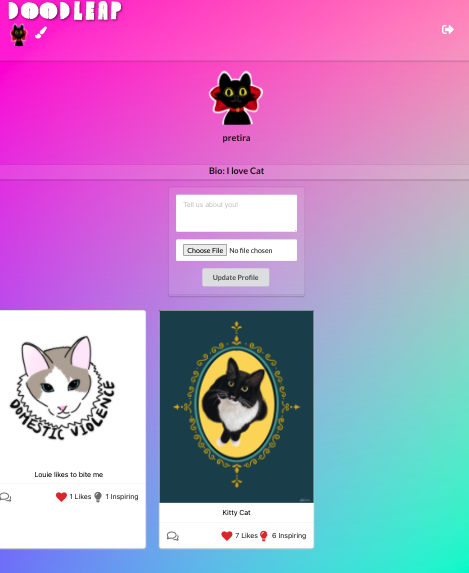
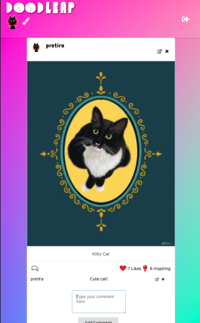
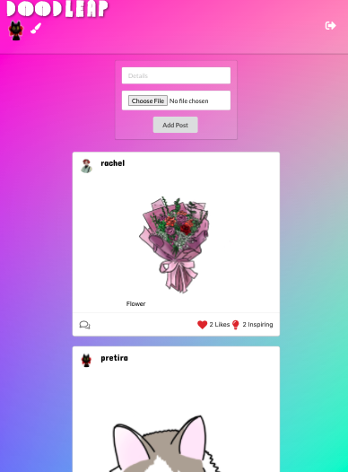
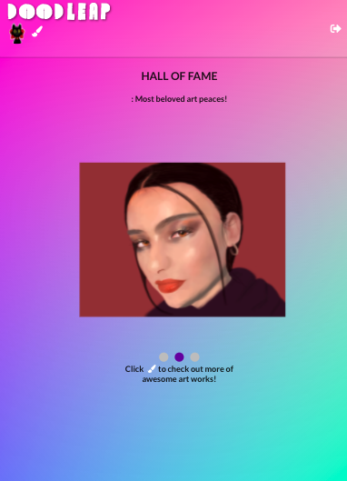

# [DOODLEAP](https://doodleap.herokuapp.com/) 
<p align="center">

</p>

Individual Post View            |  Posts Page         |        Hall of Fame Page
:-------------------------:|:-------------------------:|:-------------------------:
 |   | 
## Join a community of artists, share your artwork, and get inspired!
---

Doodleap lets people post pictures of their art and lets them view other peoples art. 
Users can react to artwork by 'liking' or 'inspiring' the art post. Users can also 
comment on other users art and provide a short description of their art. The most 
'liked' and or 'inspired' work is showcased on the Hall of Fame page.

---
## Tech Stack - MERN
- MongoDB
- ExpressJS
- React
- NodeJS

## Technical Summary
```
Doodleap is a react app built with ExpressJS hosted on Node server via Heroku. The backend is deployed using MongoDB Atlas and connected to the frontend via Mongoose. The photos are hosted on a AWS S3 Bucket.

Doodleap has full CRUD functionality. Users can create, update and delete their posts. Users can also view and react to other users posts.
```
---
## Next Steps
- Doodle feature, allow users to draw directly in the app and post it.
- Clean up UI more, possibly by working with Bootstrap.
- Add catagorization through '#`s' i.e. #cat #art #fridayart etc.
- Thumbnail feature, so links shared outside of Doodleap have a picture and description.


#### Link to the deployed app: [DOODLEAP](https://doodleap.herokuapp.com/) 